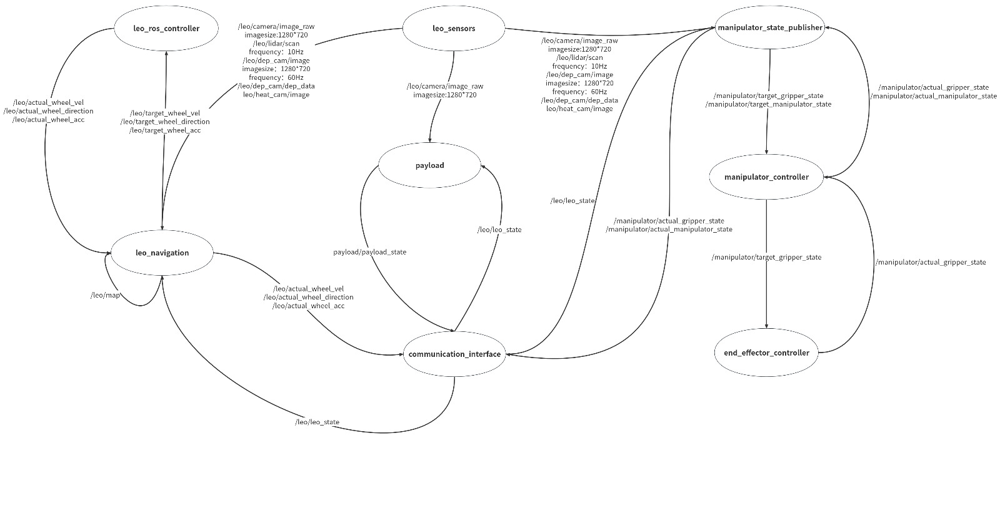

# AERO62520: LEO ROBOTICS SYSTEMS DESIGN PROJECT

**Maintainer:** team 2


The Leo Rover with PincherX-150 ROS package integrates the Leo Rover mobile robot and PincherX-150 robotic arm, providing a comprehensive set of nodes for controlling and managing both the robot's mobility and the arm's manipulation capabilities. This package facilitates seamless communication and coordination between different nodes for a unified robotic system.

# Table of Contents

[Features](#features)

[Node](#node)

[Install](#install)

[Folder Structure](#folder-structure)

[Contributing](#contributing)

[License](#license)

[Contact](#Contact)

# Features

* **Localisation and Mapping**: Simultaneous Localization and Mapping (SLAM) capabilities and integration with popular SLAM algorithms.

* **Navigation**: Path planning algorithms and obstacle avoidance.

* **Sensors and Noise Models**: Generate sensor data, optionally with noise,
from LIDAR sensor, heat cameras, depth sensors.


* **Communication**: ROS node communication for seamless integration with other ROS packages.


* **Simulation models**: Integration with ROS Gazebo for simulation and use launch files for simulation environments.

* **Safety**: Collision detection and prevention and
Emergency stop functionality.

## Nodes

### 1. leo_ros_controller

This node is responsible for controlling the Leo Rover's chassis motion, including wheel speed and direction.

### 2. leo_sensors

The leo_sensors node processes and publishes data from a variety of sensors mounted on the Leo Rover, such as cameras, LiDAR, depth cameras, and heat cameras.

### 3. leo_navigation

The leo_navigation node serves as the navigation system, incorporating SLAM algorithms and path planning functionalities.

### 4. communication_interface

The communication_interface node manages the communication interface between the robot and different nodes for the mechanical arm and payload.

### 5. payload

The Payload node is responsible for the carrying and releasing of objects.

### 6. manipulator_controller

This node handles the motion control of the robotic arm, accepting motion commands and driving joints or actuators.

### 7. manipulator_state_publisher

The manipulator_state_publisher node publishes information about the robotic arm's state, such as joint angles and positions.

### 8. end_effector_controller

The end_effector_controller node controls the end effector of the robotic arm, such as a gripper or other tools.

### RQT Graph

 

## Install

This branch supports ROS Humble. See this [INSTALL.md](INSTALL.md) for more details of install.


# Folder Structure

Refer to the following table for information about important directories and files in this repository.

```
leo_robotic
├── img
├── ros_leo        
├── ros_leo_bridge
├── ros_leo_pointcloud
├── ros_leo_sim
├── ros_leo_sim_demos
├── test                         Test for code.
└── README.md                    This readme.
```

# Contributing

Please see
[CONTRIBUTING.md](https://github.com/gazebosim/gz-sim/blob/main/CONTRIBUTING.md).


# License

This library is licensed under [Apache 2.0](https://www.apache.org/licenses/LICENSE-2.0). See also the [LICENSE](https://github.com/gazebosim/gz-sim/blob/main/LICENSE) file.

# Contact
For inquiries and support, contact [maintainer's email]